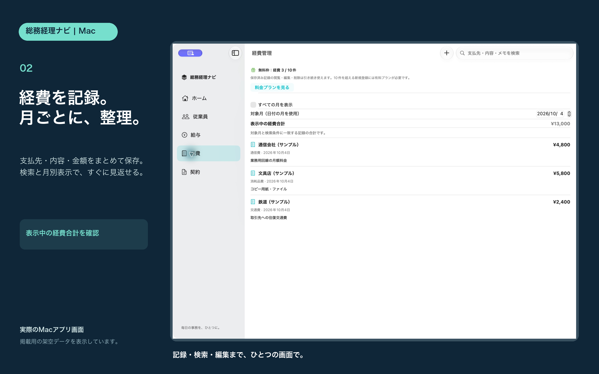
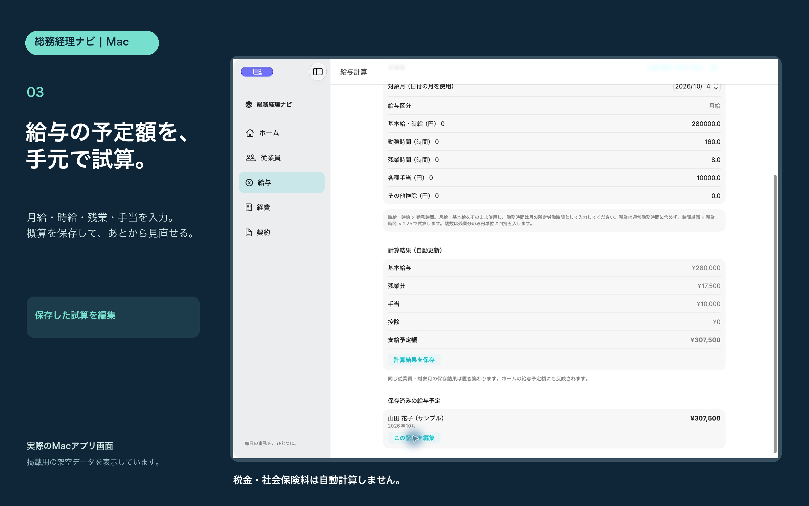

# 総務経理ナビ Mac

macOS 14以降に対応したネイティブMacアプリです。サイドバーから従業員・給与の試算・経費・契約情報を開きます。

## 掲載画像

実装済みのMac版の実画面です。掲載用の架空データをメモリ内で表示しています。

## 利用と料金

各機能10件まで無料。日本の有料プランは月額600円・年額6,000円で、登録件数の制限を解除します。実際の価格と条件はAppleの購入画面で確認してください。給与は概算で、税金・社会保険料は自動計算しません。クラウド同期、アプリ内バックアップ・エクスポート、請求書管理、契約書本文・PDF出力はありません。

記録は端末ごとの保存です。MacとiPhoneの間でデータは同期されません。記録の削除は一覧を右クリックして行います。

## 開発用ファイル

[Mac版ソースZIP](SomuKeiriNaviMac-source.zip)を展開し、Project/SomuKeiriNavi.xcodeprojをXcodeで開きます。署名にはApple Developerアカウントが必要です。開発用のPreviewスキームは架空のサンプルを表示します。Releaseではサンプルとテスト用の起動引数を無効にしています。

## 提出状況

2026年10月4日：Mac版1.0（ビルド2）の署名付きアーカイブとApp Store Connectへのアップロードが完了。掲載画像3枚を登録済み。Appleへ審査提出済みで、現在は審査待ちです。承認後の自動リリースを設定しています。

[サポート](SUPPORT.md) / [プライバシー](PRIVACY.md)
